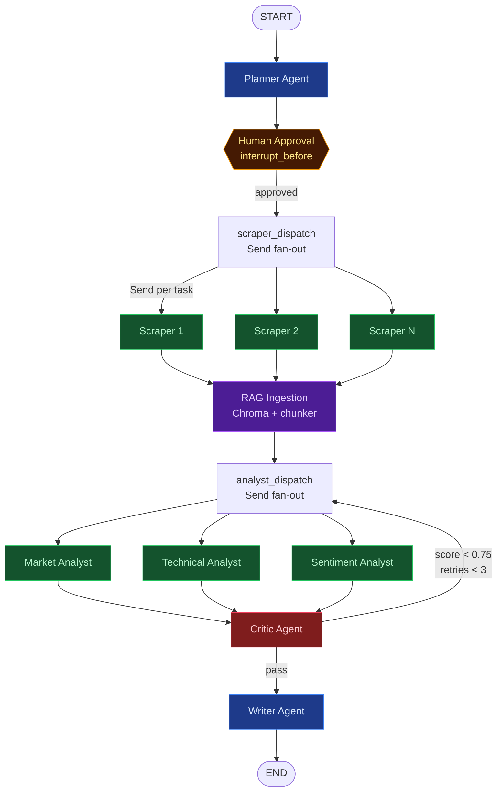

# Athena — Autonomous Competitive Intelligence Platform

Athena researches any company autonomously. Enter a company name, approve a research plan, and Athena deploys multiple AI agents in parallel to scrape the web, build a runtime RAG knowledge base, analyze data from multiple angles, self-critique its output, and deliver a structured competitive intelligence report.

**Backend:** FastAPI + LangGraph + LangChain + ChromaDB + SQLite
**Frontend:** Next.js 14 + TypeScript + Redux Toolkit + Tailwind CSS

> Full visual breakdown: see [docs/architecture.html](docs/architecture.html) — open it in a browser for the styled architecture doc.

---

## Architecture



Key LangGraph features in play: **Send API** (parallel fan-out), **interrupt_before** (human-in-the-loop), **conditional edges** (critic retry loop), **operator.add** annotation (merging parallel results), **astream_events** (real-time WebSocket streaming).

---

## Features

### Shipped

| Feature | Description |
|---|---|
| **Multi-agent pipeline** | Planner → Scrapers → RAG → Analysts → Critic → Writer, end-to-end on one StateGraph |
| **Parallel fan-out** | Scrapers and analysts run concurrently via the Send API |
| **Editable plan approval** | Inline-edit tasks, drag-to-reorder, add new tasks, or regenerate the whole plan before approving |
| **Human-in-the-loop** | Plan approval interrupt before any expensive scraping |
| **Critic feedback loop** | Quality-scored retry of analysts (up to 3×) |
| **Runtime RAG** | One ChromaDB collection per company, built per-run, queried by analysts |
| **Live agent timeline** | WebSocket streams node-start, token, and node-done events to the UI |
| **Optional seed URL** | Provide a company's primary site to skip the cold-start search step |
| **Search history** | Past runs persisted in SQLite; survives backend restarts |
| **Side-by-side comparison** | Run two research jobs in parallel + a comparator pass that synthesizes differences |
| **Per-run token & cost tracking** | Aggregated via a LangChain callback, surfaced in the UI as a token badge |
| **Free-first defaults** | Groq + HuggingFace embeddings = zero cost to run locally |
| **Provider swap via env var** | Switch LLM (Groq ↔ Anthropic) or embeddings (HF ↔ OpenAI) with one variable |
| **Markdown export** | Download any report as `.md` from the UI |

### Roadmap (TODO)

Items pulled from the project roadmap, in rough priority order:

- [ ] **LangSmith tracing** — drop-in observability for every node + LLM call (`LANGCHAIN_TRACING_V2=true`, two-env-var setup). Foundation for an eval dataset later.
- [ ] **Chat with the research** — after a run completes, expose a chat box that queries the same ChromaDB collection. Multiplies value of every research run for ~zero extra scrape cost.
- [ ] **Configurable analyst set** — checkbox UI for "Market / Technical / Sentiment" so you can skip ones you don't need and save tokens.
- [ ] **Citation viewer** — clicking a `[Source: https://…]` reference in the rendered report pops open the actual scraped chunk that produced that claim.
- [ ] **Watchlist + scheduled re-runs** — "Re-run this report every Monday." Track how a competitor's pricing, hiring, or sentiment moves over time. Diff view between runs.
- [ ] **Industry presets** — "This is a SaaS company" / "This is a DTC brand" tweaks analyst prompts and planner strategy for sharper output.
- [ ] **PDF export** — Markdown → PDF via WeasyPrint or Playwright.
- [ ] **Bring-your-own API key** — paste Groq/Anthropic keys in the UI instead of `backend/.env`. Required if this ever goes multi-user.
- [ ] **Auto-share to Slack / email digest** — push the report to a webhook after completion.
- [ ] **Agentic scraper / analyst** — wrap `scraper_worker` and `analyst_worker` with `create_agent` so they can autonomously re-query, pick tools, and self-judge result sufficiency.

---

## Prerequisites

- **Python 3.11+**
- **Node.js 18+**
- **One API key** — either Groq (free) or Anthropic (paid)

---

## Provider Options

| Component | Free (default) | Paid |
|-----------|---------------|------|
| **LLM** | Groq — `llama-3.3-70b-versatile` | Anthropic — Claude Sonnet |
| **Embeddings** | HuggingFace — `BAAI/bge-small-en-v1.5` (local) | OpenAI — `text-embedding-3-small` |
| **Search** | DuckDuckGo (no key needed) | — |

**Free path:** Only need a Groq API key (sign up at [console.groq.com](https://console.groq.com)). Embeddings run locally.

---

## Local Setup

### 1. Backend

```bash
cd Athena

# Create virtual environment
python -m venv venv

# Activate (Windows)
venv\Scripts\activate
# Activate (macOS/Linux)
source venv/bin/activate

# Install dependencies
pip install -r requirements.txt

# Configure environment
cd backend
cp .env.example .env
# Edit backend/.env — add your GROQ_API_KEY (or ANTHROPIC_API_KEY)
```

### 2. Start the backend

```bash
# From project root
uvicorn backend.main:app --reload --port 8000
```

API: `http://localhost:8000` | Health: `http://localhost:8000/health`

> First run will download the embedding model (~130MB). This only happens once.

### 3. Frontend

```bash
cd frontend
cp .env.example .env.local
npm install
npm run dev
```

App: `http://localhost:3000`

---

## Usage

1. Open `http://localhost:3000`
2. Enter a company name (e.g., "Notion", "Stripe", "Linear")
3. *(Optional)* paste the company's website to give the planner a seed URL
4. Review the research plan generated by the Planner agent — edit tasks inline, drag the grip handle to reorder, click **+ Add** for extra tasks, hit the trash icon to drop one, or **Regenerate** to re-run the planner from scratch
5. Click **Approve & Start Research** (the edited plan is sent to the backend on approval)
6. Watch the AI agents work in real-time via the timeline
7. View, copy, or download the final intelligence report

Plan editing limits: **1–8 tasks**, **2–200 characters** each. Enforced both client- and server-side.

**To compare two companies:** click *"Or compare two companies side-by-side →"* on the home page. Both research pipelines run concurrently and a comparator synthesizes a side-by-side report.

**Past runs:** the home page lists recent research jobs from SQLite — click any to reopen its report.

---

## Environment Files

```
backend/.env          ← LLM keys, embedding config, server settings
backend/.env.example  ← Template (committed to git)

frontend/.env.local   ← API URLs
frontend/.env.example ← Template (committed to git)
```

### backend/.env key settings

```bash
# Choose LLM: "groq" (free) or "anthropic" (paid)
LLM_PROVIDER=groq
GROQ_API_KEY=gsk_...

# Choose Embeddings: "huggingface" (free/local) or "openai" (paid)
EMBEDDING_PROVIDER=huggingface
HF_EMBEDDING_MODEL=BAAI/bge-small-en-v1.5
```

---

## API Endpoints

| Method | Endpoint | Description |
|--------|----------|-------------|
| `POST` | `/api/research/start` | Start research (returns plan, persists initial row) |
| `POST` | `/api/research/{job_id}/approve` | Approve plan (optionally with an edited `plan: string[]` in the body); resumes the graph |
| `POST` | `/api/research/{job_id}/regenerate` | Re-run the planner and replace the pending plan (only while awaiting approval) |
| `GET`  | `/api/research/{job_id}/status` | Current job status |
| `GET`  | `/api/research/{job_id}/report` | Final report + token totals |
| `GET`  | `/api/research/history` | List recent research jobs (newest first) |
| `POST` | `/api/research/compare` | Start a two-company comparison (background) |
| `WS`   | `/api/ws/research/{job_id}` | Real-time event stream |
| `GET`  | `/health` | Health check |

---

## Project Structure

```
Athena/
├── backend/
│   ├── api/
│   │   ├── routes.py             # FastAPI REST endpoints (start/approve/status/report/history/compare)
│   │   └── ws.py                 # WebSocket streaming + completion persistence
│   ├── core/
│   │   ├── state.py              # AthenaState TypedDict
│   │   ├── config.py             # Environment config
│   │   ├── llm.py                # LLM factory (Groq or Anthropic)
│   │   ├── embeddings.py         # Embedding factory (HuggingFace or OpenAI)
│   │   ├── tokens.py             # TokenTracker callback handler
│   │   └── db.py                 # SQLite persistence for jobs + reports
│   ├── graph/
│   │   └── builder.py            # LangGraph StateGraph assembly
│   ├── nodes/
│   │   ├── planner.py            # Research planning agent (seed-URL aware)
│   │   ├── scraper_dispatch.py   # Parallel scraper fan-out (Send API)
│   │   ├── scraper_worker.py     # Web search + content extraction (URL fast-path)
│   │   ├── rag_ingest.py         # ChromaDB chunk + embed + persist
│   │   ├── analyst_dispatch.py   # Parallel analyst fan-out
│   │   ├── analyst_worker.py     # Market / Technical / Sentiment analysts
│   │   ├── critic.py             # Quality scoring + retry routing
│   │   ├── writer.py             # Final report synthesis
│   │   └── comparator.py         # Side-by-side comparison synth (off-graph)
│   ├── main.py                   # FastAPI app entrypoint + db init
│   ├── .env                      # Backend environment (gitignored)
│   ├── .env.example              # Backend env template
│   └── Dockerfile
├── frontend/
│   ├── app/
│   │   ├── page.tsx              # Home: input + compare CTA + history
│   │   ├── research/[jobId]/     # Single-research result page
│   │   └── compare/              # Compare input + result pages
│   ├── components/
│   │   ├── CompanyInput.tsx      # Company + optional URL input
│   │   ├── PlanApproval.tsx
│   │   ├── AgentTimeline.tsx
│   │   ├── ReportViewer.tsx
│   │   ├── StatusBadge.tsx
│   │   ├── TokenBadge.tsx        # Token / cost display
│   │   └── HistoryList.tsx       # Past runs from /research/history
│   ├── hooks/                    # useResearchStream (WS), usePolling
│   ├── lib/                      # Redux store + researchSlice
│   ├── .env.local                # Frontend environment (gitignored)
│   ├── .env.example              # Frontend env template
│   └── Dockerfile
├── data/                         # ChromaDB + athena.db (gitignored)
├── docs/
│   └── architecture.html         # Visual architecture doc
├── requirements.txt
├── docker-compose.yml            # Optional: containerized dev
└── README.md
```

---

## Embedding Model Options

| Model | Dims | Download | Quality | Speed |
|-------|------|----------|---------|-------|
| `BAAI/bge-small-en-v1.5` | 384 | 130MB | Best ratio (default) | Fast |
| `all-mpnet-base-v2` | 768 | 420MB | Highest | Slower |
| `all-MiniLM-L6-v2` | 384 | 90MB | Good | Fastest |

Set via `HF_EMBEDDING_MODEL` in `backend/.env`. All run locally without GPU.

---

## Key Technical Decisions

| Decision | Rationale |
|----------|-----------|
| Groq as default LLM | Free tier, fast inference, no credit card |
| HuggingFace local embeddings | Zero cost, no API key, good quality |
| LangGraph MemorySaver | No Postgres needed for local dev; swap to `AsyncPostgresSaver` for prod |
| SQLite for app persistence | Reports + history survive restarts without adding a Postgres dependency |
| ChromaDB PersistentClient | No Docker needed, persists to disk |
| No Celery | Graph runs inline in async FastAPI |
| Send API | Parallel execution of scrapers and analysts |
| DuckDuckGo Search | Free, no API key required |
| Comparison off-graph | Separate route runs two pipelines via `asyncio.gather` and a comparator pass — keeps the main StateGraph single-tenant |
| Separate `.env` per service | Clean separation, ready for deployment |

---

## LangGraph Patterns Used

- **Send API** — Dynamic parallel fan-out to N scraper/analyst workers
- **interrupt_before** — Human-in-the-loop checkpoint for plan approval
- **Conditional edges** — Critic score routing (retry or proceed)
- **Annotated reducers** — `operator.add` for lists, custom dict-merger for parallel analyst outputs
- **astream_events** — Real-time WebSocket streaming of graph execution
- **MemorySaver** — In-memory checkpointing for state persistence
- **LangChain callbacks** — `TokenTracker` accumulates per-job token usage from every LLM call

---

## Docker (Optional)

```bash
docker-compose up --build
```

Backend on port 8000, frontend on port 3000.

---

## Troubleshooting

**"Import could not be resolved"** — Run `pip install -r requirements.txt` in your venv.

**First run is slow** — Embedding model downloads once (~130MB). Subsequent runs are instant.

**`ECONNREFUSED 127.0.0.1:8000`** — Frontend can't reach backend. Start `uvicorn backend.main:app --reload --port 8000` in a second terminal.

**ChromaDB errors** — Delete `data/chroma/` directory and restart.

**SQLite locked** — Stop all backend processes and remove `data/athena.db` (last resort — wipes history).

**Groq rate limit** — Free tier allows ~30 requests/min. Wait a moment and retry. Comparison runs roughly 2× the LLM calls of a single research job plus a synthesis pass.

**WebSocket not connecting** — Ensure backend is on port 8000 and frontend proxies `/api/*`.
